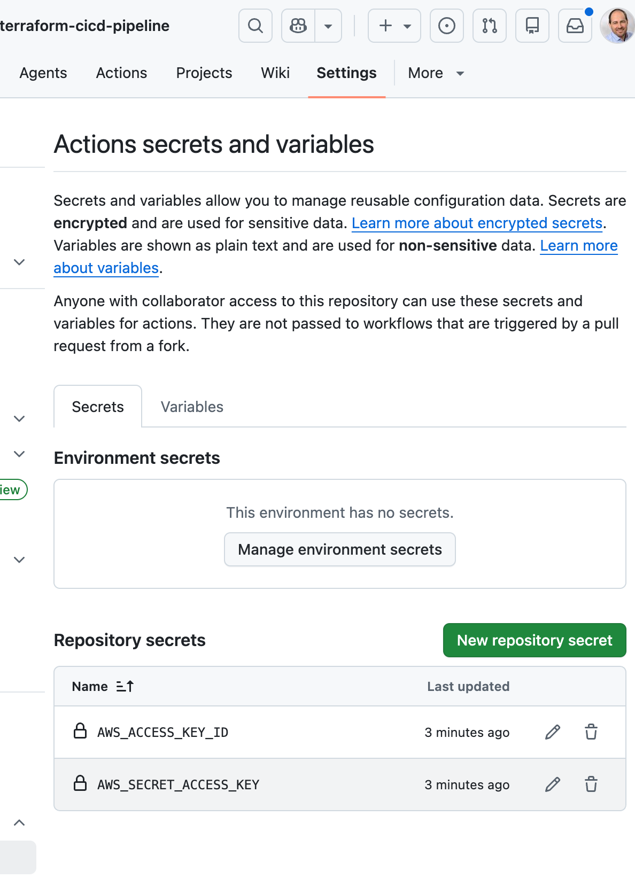
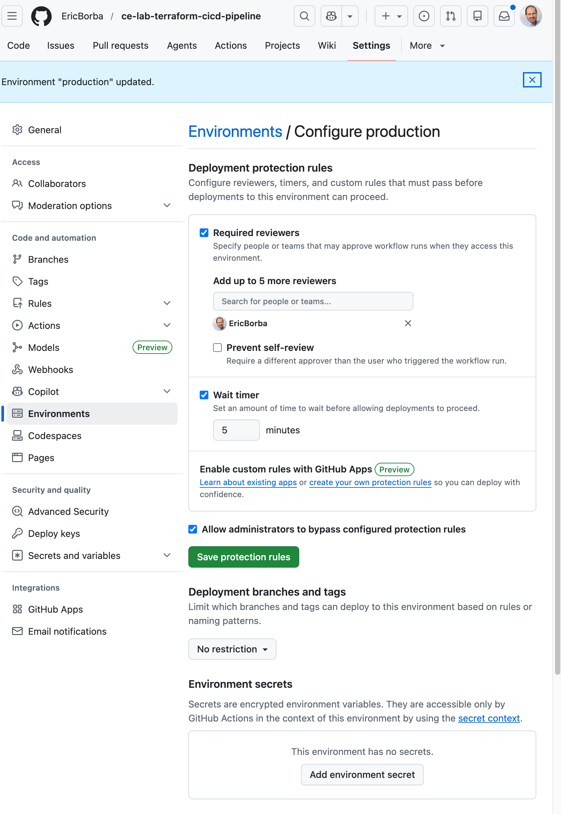
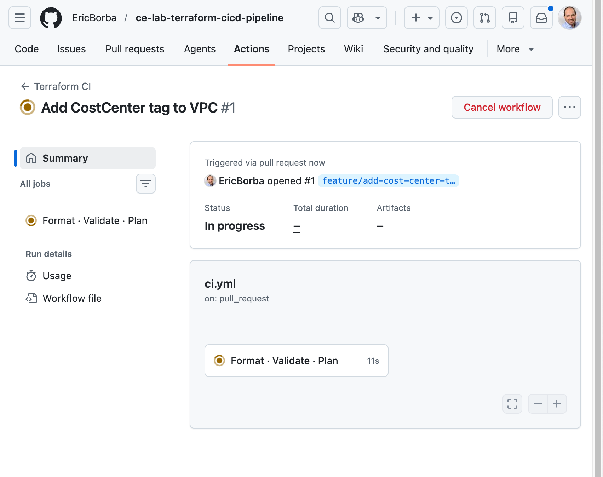
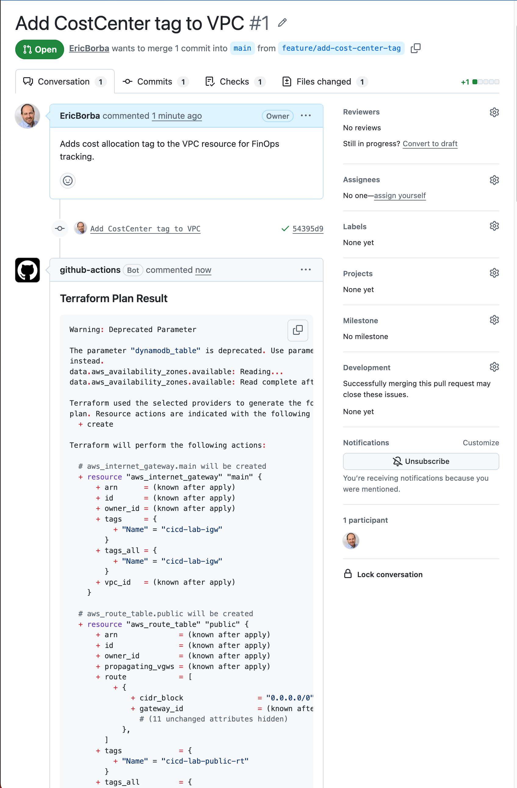
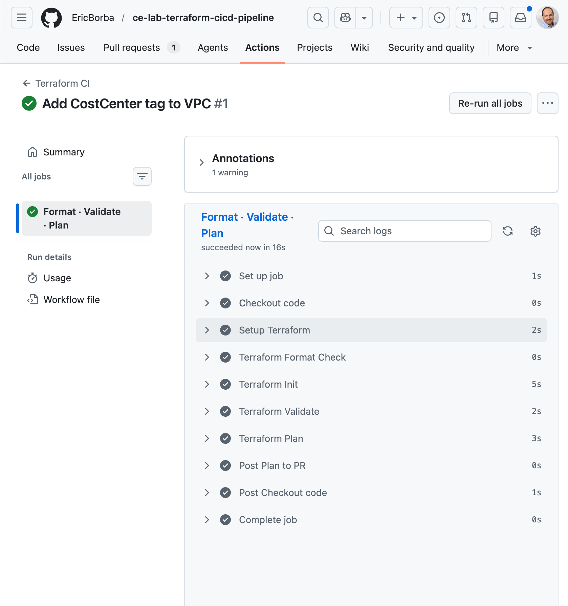
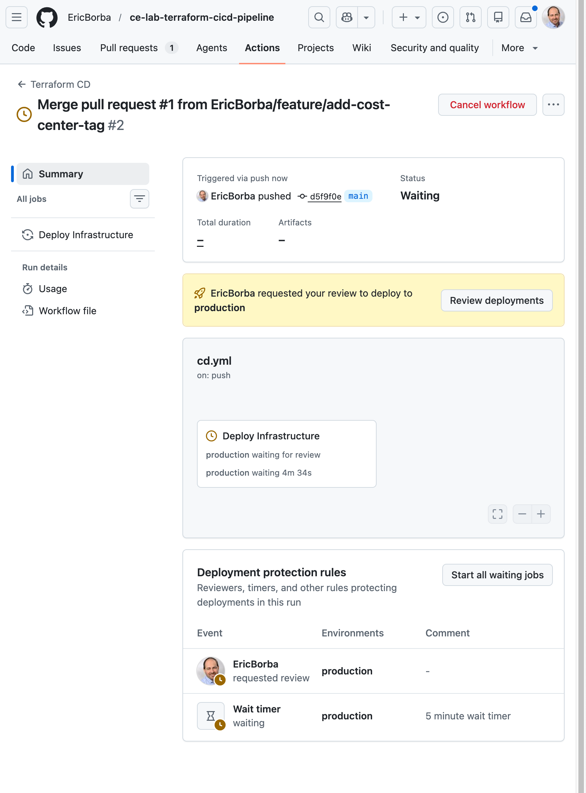
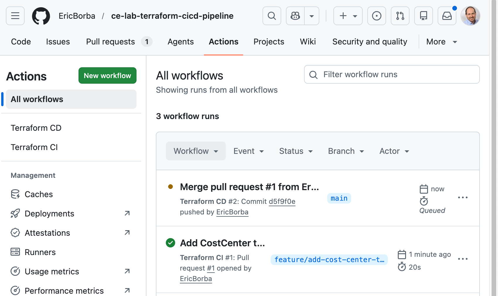
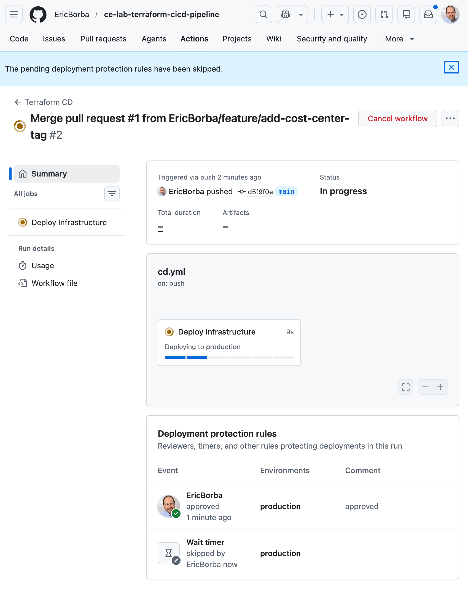
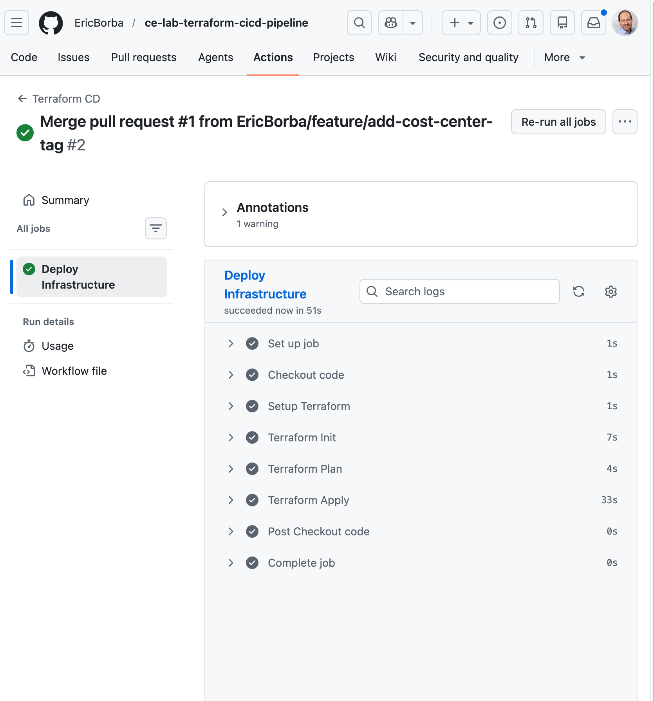

# Lab 40 – CI/CD Pipeline for Terraform with GitHub Actions

## Overview

This lab implements a fully automated CI/CD pipeline for Terraform infrastructure using GitHub Actions. A change to a VPC resource is used as the end-to-end scenario to validate the pipeline from pull request creation through production deployment.

## Infrastructure

The Terraform code provisions a networking baseline on AWS:

| Resource | Details |
|---|---|
| VPC | `10.1.0.0/16`, DNS hostnames and support enabled |
| Public Subnets | 2× subnets (`10.1.1.0/24`, `10.1.2.0/24`) across AZs |
| Private Subnets | 2× subnets (`10.1.11.0/24`, `10.1.12.0/24`) across AZs |
| Internet Gateway | Attached to the VPC |
| Public Route Table | Default route `0.0.0.0/0` via IGW |

**Remote state** is stored in S3 (`ce-bootcamp-tfstate-eric-borba`) with DynamoDB state locking.

## Pipeline Architecture

Two GitHub Actions workflows implement the CI/CD flow:

```
Feature Branch ──► Pull Request ──► main
                        │               │
                    [ci.yml]        [cd.yml]
                  Format Check      Init
                     Init           Plan
                   Validate         Apply
                     Plan       (production env)
                  Post to PR
```

### CI Workflow (`ci.yml`)

Triggered on every **pull request** targeting `main`.

| Step | Action |
|---|---|
| Checkout | `actions/checkout@v4` |
| Setup Terraform | `hashicorp/setup-terraform@v3` (latest) |
| Format Check | `terraform fmt -check -recursive` |
| Init | `terraform init` (uses S3 backend) |
| Validate | `terraform validate -no-color` |
| Plan | `terraform plan -input=false -no-color -out=tfplan` |
| Post Plan | Posts the plan output as a PR comment via `actions/github-script@v7` |

### CD Workflow (`cd.yml`)

Triggered on every **push to `main`** (i.e., after PR merge).

| Step | Action |
|---|---|
| Checkout | `actions/checkout@v4` |
| Setup Terraform | `hashicorp/setup-terraform@v3` (latest) |
| Init | `terraform init` |
| Plan | `terraform plan -input=false -no-color` |
| Apply | `terraform apply -auto-approve -input=false -no-color` |

The job runs in the `production` GitHub Environment, which enforces deployment protection rules before the apply step executes.

## Setup

### 1. Repository Secrets

Navigate to **Settings → Secrets and variables → Actions** and add:

| Secret | Description |
|---|---|
| `AWS_ACCESS_KEY_ID` | IAM user access key with permissions to manage the target resources |
| `AWS_SECRET_ACCESS_KEY` | Corresponding secret access key |



### 2. Production Environment Protection Rules

Navigate to **Settings → Environments → production** and configure:

- **Required reviewers** – add at least one reviewer who must approve before the CD job proceeds
- **Wait timer** – set to 5 minutes to allow time to review before deployment starts



## Lab Walkthrough

### Step 1 – Open a Pull Request

Create a feature branch, make a change to the infrastructure (e.g., adding a `CostCenter` tag to the VPC), and open a PR targeting `main`.

### Step 2 – CI Pipeline Runs

The `ci.yml` workflow triggers automatically on the PR. The **Format · Validate · Plan** job runs all checks.



### Step 3 – Terraform Plan Posted to PR

After the plan step, the workflow posts the full plan output as a PR comment so reviewers can inspect the expected changes before approving.



### Step 4 – CI Passes

All steps complete successfully and the PR shows a green check.



### Step 5 – Merge to Main

After review, merge the PR into `main`. The CD workflow triggers immediately.



### Step 6 – CD Deployment Gate

The `production` environment protection rules pause the workflow. A required reviewer must approve the deployment and the wait timer must elapse before the apply proceeds.



### Step 7 – Deployment Proceeds

Once approved, the CD pipeline resumes and runs `terraform apply`.



### Step 8 – CD Passes

The **Deploy Infrastructure** job completes successfully. Infrastructure is live in AWS.



## File Structure

```
m5-02-cicd/
├── .github/
│   └── workflows/
│       ├── ci.yml          # PR validation pipeline
│       └── cd.yml          # Deployment pipeline
├── backend.tf              # S3 remote state + DynamoDB locking
├── main.tf                 # VPC, subnets, IGW, route tables
├── variables.tf            # Input variable declarations
├── outputs.tf              # VPC and subnet ID outputs
├── terraform.tfvars        # Variable values
└── screenshots/            # Lab evidence
```

## Key Concepts Demonstrated

- **Separation of CI and CD** – validation runs on every PR; deployment only runs after merge to the protected branch
- **Plan-as-PR-comment** – reviewers see the exact Terraform plan before approving the merge, not just passing checks
- **Environment protection rules** – required reviewer approval and a wait timer gate production deployments, preventing accidental or instant applies
- **Remote state with locking** – S3 backend with DynamoDB ensures state consistency across CI and CD runs
- **Least-privilege secrets** – AWS credentials are stored as encrypted repository secrets and never exposed in logs
